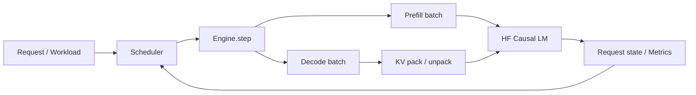

# MiniServe

一个从零实现的教学型 LLM continuous-batching inference engine。项目覆盖 per-request KV Cache、异长 context batched decode、prefill/decode 共存、动态请求接纳、token-budget scheduling、serving metrics、GPU benchmark 与 profiling。



核心目标是解释真实 serving 系统的控制流、KV 生命周期和性能取舍，而不是包装一个聊天 API。完整架构与 invariant 见 [architecture.md](docs/architecture.md)。

准备简历深挖或项目答辩时，可直接阅读 [MiniServe 项目架构与面试答辩手册](docs/interview_handbook.md)：其中包含完整架构图、状态机、两条 KV 路径、调度算法、性能实验、设计取舍和 35 个高频问题。

Phase B 已实现固定大小 KV block allocator、请求级 block table/slot mapping，以及可选的 paged KV storage + Hugging Face gather adapter；设计见 [block_allocator.md](docs/block_allocator.md)、[block_table.md](docs/block_table.md) 和 [paged_kv.md](docs/paged_kv.md)。Paged backend 已接入真实 Engine，但因 HF attention 仍需 gather/cat，GPU A/B 中没有获得性能提升。

Dynamic KV backend 支持显式 `--chunked-prefill`：长 prompt 可跨轮处理，decode 请求优先占用 token budget。设计、限制和负性能实验见 [chunked_prefill.md](docs/chunked_prefill.md)。

Paged KV backend 还支持显式容量水位抢占：Engine 释放 LIFO victim 的 blocks，Scheduler 将其放回等待队列，随后从 token history 重建 KV。它与当前仅支持 dynamic backend 的 chunked prefill 是两条独立实验路径；设计与正确性边界见 [preemption.md](docs/preemption.md)。

Phase B 已完成。最终 profiler-driven 实验尝试用 direct copy 替换 dynamic KV 的 `pad + cat`，correctness 通过但端到端 GPU 指标回退，因此候选实现未保留；原始数据、限制和后续方向见 [phase_b_report.md](docs/phase_b_report.md)。

## 功能

- WAITING → RUNNING → FINISHED 请求状态机与 PREFILL → DECODE 阶段。
- FIFO admission、动态 slot 复用、最大并发数与每轮 token budget。
- 新请求 prefill 与已有请求 decode 在同一 Engine iteration 共存。
- 不同 context length 的 per-request KV pack、batched forward 和 unpack。
- Queue wait、TTFT、ITL、TPOT、E2E、吞吐和峰值 CUDA 显存。
- Burst、constant、Poisson 到达 workload，原始样本 JSON 与报告聚合。
- Engine phase、PyTorch operator 和 Nsight Systems profiling 入口。
- 跨策略逐 token 对照与 Hugging Face greedy reference。

## GPU 结果摘要

RTX 4070 Laptop GPU、Qwen2.5-0.5B-Instruct BF16、12 个 burst 请求、最多 8 个输出 token、3 次重复：

| Policy | Capacity / Budget | Output tok/s median | TTFT P50 | ITL P99 | Peak allocated |
|---|---:|---:|---:|---:|---:|
| sequential | 1 / 64 | 20.13 | 1280.92 ms | 76.27 ms | 969.5 MiB |
| continuous | 4 / 64 | 37.92 | 514.85 ms | 174.76 ms | 970.4 MiB |

在该有限 workload 下，capacity 4 的吞吐中位数提高约 88%、TTFT P50 降低约 60%，同时 ITL P99 上升。实验合同、完整矩阵和限制见 [phase_a_report.md](docs/phase_a_report.md)，原始 JSON 位于 [`step22_qwen_gpu_burst.json`](benchmarks/results/step22_qwen_gpu_burst.json)。

## 运行完整链路

在项目根目录，使用已经安装项目依赖的 `.venv`：

```bash
.venv/bin/python scripts/run_engine.py --check-reference
```

默认在 CPU 上运行随机初始化的小型 Llama，无需下载模型。输出 token 不具备文本意义，但会实际执行模型 forward、KV pack/unpack 和完整调度流程。

```text
Request → Scheduler → Engine → DecodeBatchRunner → Model / KV → Metrics
```

脚本在第 0 轮提交 A、第 1 轮提交 B/C、第 2 轮提交 D。它会输出：

- 每轮 prefill / decode 成员、waiting / running / finished、输入 token 预算用量。
- 各请求的输出 token 或解码文本。
- Queue wait、TTFT、TPOT、ITL、E2E 的样本数、均值、P50/P99。
- 整个 workload 的输出 tokens/s、requests/s。
- 使用 `--check-reference` 时，与每个请求独立 HF `generate()` 的逐 token 一致性结果；不一致则失败退出。

模型加载、tokenization、预热和 HF 对照不计入测量窗口。轨迹在执行期间保存在内存，结束后统一打印，避免终端输出干扰每轮计时。

## 使用本地模型

```bash
.venv/bin/python scripts/run_engine.py \
  --model /home/henry/project/models/Qwen2.5-0.5B-Instruct \
  --device cpu \
  --max-new-tokens 8 \
  --check-reference
```

有可用 GPU 时，可改用 `--device cuda`。脚本只加载本地模型文件，不自动下载。当前实现以本地 Qwen2.5 的普通完整 KV attention 路径为验证对象，并不保证兼容所有 HF 模型架构。

## 调整调度配置

```bash
.venv/bin/python scripts/run_engine.py \
  --max-running 3 \
  --token-budget 6 \
  --max-new-tokens 8 \
  --check-reference
```

小模型默认预算 6，本地模型默认预算 256。预算必须不小于 `max-running`，且能够容纳每个完整 prompt；不满足时明确报错。

默认小模型演示中，D 的 prompt 长度为 5：A/C 同时 decode 时剩余预算只有 4，因此即使存在空槽位，D 也必须等待。这展示了请求数容量与 token budget 的不同作用。

## 演示与测试的区别

`run_engine.py` 是联调演示：真实运行整个系统，并可检查输出正确性。它只有四个请求，按轮次到达，没有真实请求率控制；随机小模型的速度、小样本 P99 都不能当作生产性能结论。每轮轨迹记录也有少量开销。

`tests/` 用于自动验证公式、状态边界和回归：

```bash
.venv/bin/python -m pytest -q
```

按时间到达的 workload 与配置对比已提供，见下节。指标定义见 [serving_metrics.md](docs/serving_metrics.md)。

`scripts/` 中其他文件是早期课程实验；部分使用历史 Engine 接口。当前整体演示请从 `scripts/run_engine.py` 开始。

## Step 19：时间驱动的 Benchmark

```bash
.venv/bin/python scripts/benchmark_serving.py \
  --arrival poisson --request-rate 50 --num-requests 24 \
  --max-running 1 3 --token-budgets 6 12 --repeats 3 \
  --check-reference --output benchmarks/results/serving.json
```

支持 burst、constant、poisson 到达。每种策略复用相同计划，报告包含实际提交与计划到达两种 TTFT、提交延迟、ITL、吞吐和原始样本。默认使用 CPU 小模型；本地模型加 `--model`，并把预算调整到足够容纳完整 prompt。

这仍是同步 Engine 的进程内实验，不含网络。方法与边界见 [workload_benchmark.md](docs/workload_benchmark.md)。

将原始 JSON 聚合为 Markdown 报告：

```bash
.venv/bin/python scripts/analyze_benchmark.py \
  benchmarks/results/serving.json \
  --output benchmarks/reports/serving.md
```

GPU 实验矩阵、显存口径和结果解释规则见 [gpu_benchmark.md](docs/gpu_benchmark.md)。
本次 RTX 4070 / Qwen2.5-0.5B 的原始结果和生成报告分别位于
[`step22_qwen_gpu_burst.json`](benchmarks/results/step22_qwen_gpu_burst.json) 与
[`step22_qwen_gpu_burst.md`](benchmarks/reports/step22_qwen_gpu_burst.md)。

## 正式入口与项目结构

当前演示、benchmark 和 profiler 入口统一使用 `miniserve.runtime` 装配模型与
Engine。正式入口、学习实验的边界和资源生命周期见
[project_structure.md](docs/project_structure.md)。

## Profiling

Engine 分阶段计时：

```bash
.venv/bin/python scripts/profile_engine.py
```

PyTorch operator trace：

```bash
.venv/bin/python scripts/profile_torch.py \
  --steps 6 --output-dir benchmarks/profiles/step21_cpu
```

有可用 NVIDIA GPU 时，使用 `--device cuda`，并可运行 `bash scripts/profile_nsys.sh ...` 生成 Nsight Systems trace。方法和边界见 [phase_profiling.md](docs/phase_profiling.md) 与 [operator_profiling.md](docs/operator_profiling.md)。
