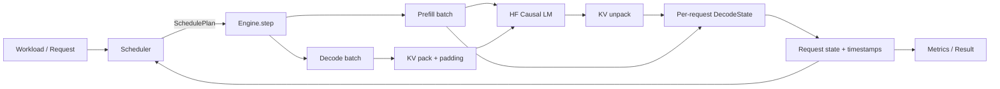
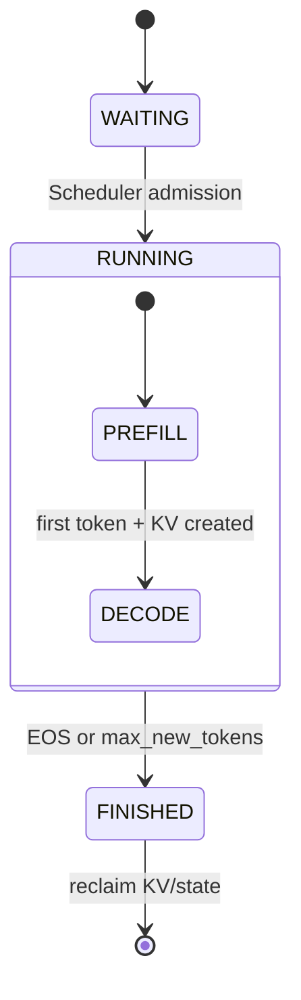

# MiniServe Architecture

## 请求到 token 的完整路径



## Control plane 与 execution plane

Scheduler 是 control plane，只读取 Request 元数据并产生一轮不可变的调度计划。它管理 waiting/running 队列、FIFO admission、并发容量和 token budget，不接触模型 tensor。

DecodeBatchRunner 是 execution plane，负责构造 tensor、执行模型 forward 和管理每请求 KV。Engine 位于两者之间：先固定本轮 prefill/decode 集合，再依次执行，最后回收完成请求。这个边界保证本轮新 prefill 的请求不会同时进入 decode。



## 一轮 Engine iteration

1. 回收上一轮已经完成的请求。
2. 为现有 decode 请求预留一个 token 的预算。
3. 在剩余容量和预算内，按 FIFO 接纳完整 prompt。
4. 固定本轮 `prefill_requests` 和 `decode_requests`。
5. Prefill 新请求，生成首 token 和初始 KV。
6. Pack 不同 context length 的 decode KV，执行一个 batched forward，再 unpack。
7. 更新时间戳和状态；完成请求在下一轮开始时回收。

## 当前 KV 数据流

```text
Request A KV [layers, heads, 20, dim] ─┐
Request B KV [layers, heads, 50, dim] ─┼─ pad + cat ─ batched forward
Request C KV [layers, heads, 18, dim] ─┘                  │
                                                        ↓
                                     slice/unpack → per-request KV
```

这种实现易于验证 heterogeneous decode correctness，但每轮会产生 padding、copy、`aten::cat` 和新 tensor allocation。Phase B 将用 block allocator、block table 和 paged KV 路径替换这部分数据搬运。

## 关键 invariant

- Request ID 全局唯一，状态只能按 WAITING → RUNNING → FINISHED 前进。
- 一轮调度输入 token 数不超过 `max_num_batched_tokens`。
- 当前完整 prefill 不拆分，因此单个 prompt 必须能放入 token budget。
- 每个 running decode 请求必须存在且只存在一份 DecodeState。
- 新 prefill 请求在下一轮才能参与 decode。
- Request 完成后，其调度槽位和 KV state 都必须回收。
