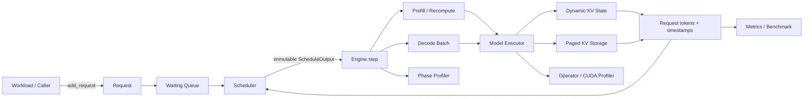
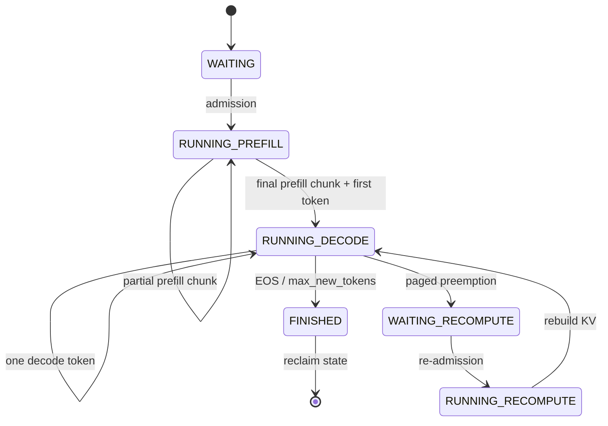
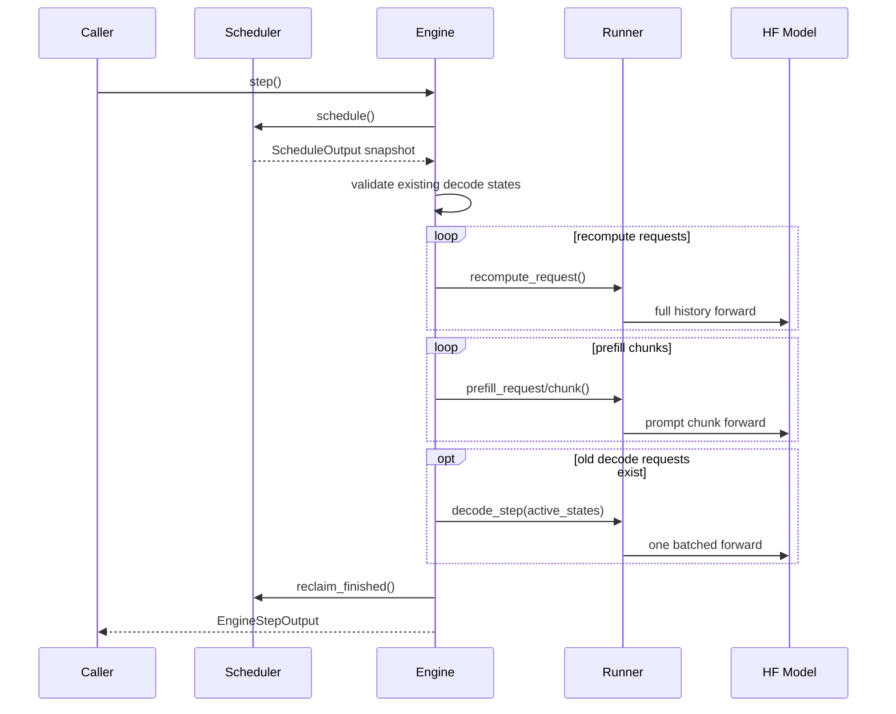
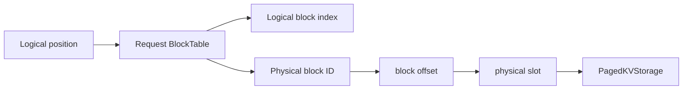
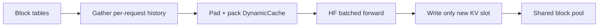
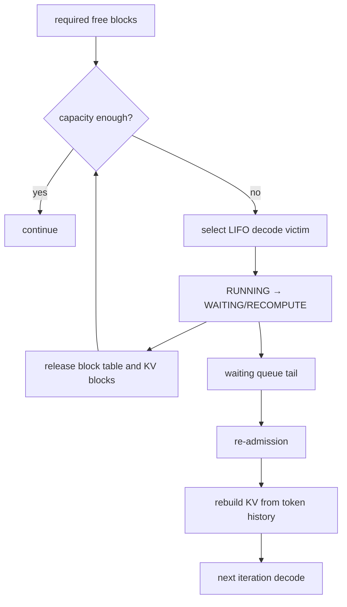

# MiniServe 项目架构与面试答辩手册

这份文档用于项目讲解、简历深挖和系统设计面试。所有能力边界以当前代码为准。

## 1. 一分钟项目介绍

MiniServe 是一个教学型 continuous-batching LLM inference engine。项目从手写 autoregressive loop 和 KV Cache 开始，逐步实现 Request 状态机、Scheduler、Engine loop、异长 context batched decode、动态请求接纳、token budget、serving metrics、GPU profiling、block allocator、block table、paged KV adapter、chunked prefill，以及 preemption/recompute。

项目的重点不是提供聊天 API，而是展示一次请求如何经过调度、模型执行、KV 生命周期和性能测量。所有生成路径都使用 Hugging Face greedy generation 做逐 token correctness 对照；当前完整回归为 118 个测试。

## 2. 项目范围和支持矩阵

### 已实现

- 单机、单 GPU、同步 step-driven Engine。
- Greedy autoregressive generation。
- Prefill 和 decode 分阶段执行。
- FIFO waiting/running queue 与 continuous batching。
- 最大并发请求数和每轮 input-token budget。
- 不同 context length 的 batched decode。
- Dynamic KV 的完整 prefill 和 chunked prefill。
- Block allocator、block table、slot mapping 和共享 paged KV storage。
- Paged KV 的显式 preemption/recompute。
- TTFT、ITL、TPOT、E2E、queue wait、吞吐与峰值 CUDA 显存。
- Engine phase、PyTorch operator 和 Nsight Systems profiling 入口。

### 当前组合矩阵

| KV backend | Full prefill | Chunked prefill | Preemption/recompute |
|---|---:|---:|---:|
| Dynamic KV | 支持 | 支持 | 不支持 |
| Paged KV adapter | 支持 | 不支持 | 支持 |

Chunked prefill 和 paged KV 在理论上是正交能力，生产系统可以同时支持。MiniServe 当前没有实现 paged partial-prefill 的增量 block 写入和相关恢复语义，因此 runtime 明确拒绝该组合。

### 没有实现

- HTTP/gRPC frontend、流式网络发送、取消和超时。
- Sampling、beam search、logits processor。
- Prefix cache、speculative decoding、swap。
- Tensor/pipeline parallel 和多 GPU 通信。
- Quantization、CUDA Graph、`torch.compile` 稳定执行路径。
- 直接读取 block table 的 PagedAttention kernel。

这些是明确的项目边界，不应在面试中宣称已经支持。

## 3. 总体架构图



架构分成三个平面：

| 平面 | 组件 | 职责 |
|---|---|---|
| Control plane | Request、Scheduler | 保存逻辑状态，决定本轮执行成员和预算 |
| Execution plane | Engine、DecodeBatchRunner、PagedDecodeBatchRunner | 构造 tensor、执行 forward、管理 KV |
| Observation plane | Metrics、Workload、Profiler | 定义负载、记录时间、定位瓶颈 |

关键边界是 Scheduler 不操作 CUDA tensor，Runner 不决定 admission policy，Engine 只协调两者。

## 4. 模块职责

### Request

**输入：** request ID、prompt token IDs、最大生成长度。

**内部状态：** lifecycle、prefill cursor、generated tokens、timestamps、抢占次数和 recompute 标记。

**输出：** Scheduler 可读取的 phase/length 属性，以及最终 token 和请求级指标。

**状态变化：** admission 后从 WAITING 进入 RUNNING；prefill 完成后进入 DECODE；paged victim 回到 WAITING/RECOMPUTE；达到 EOS 或长度限制后进入 FINISHED。

Request 不持有模型或 CUDA KV tensor。这样逻辑请求即使释放物理 KV，仍能依靠 token history 恢复。

### Scheduler

**输入：** waiting/running 请求元数据、并发容量、token budget。

**内部状态：** FIFO waiting deque、running list、finished history。

**输出：** 一轮不可变 `ScheduleOutput`，包括 prefill chunks、recompute requests、decode requests 和 scheduled-token 数。

**状态变化：** 先回收完成请求，再为已有工作计费，最后按 FIFO 和剩余资源 admission。Scheduler 不执行模型 forward，也不知道 KV tensor layout。

### Engine

**输入：** Scheduler、Runner，以及可选 profiler。

**内部状态：** `request_id -> DecodeState` 索引和 iteration 计数。

**输出：** 本轮 prefill/chunk/decode/finish 摘要。

**状态变化：** 调度后先校验旧 decode state，再执行 recompute/prefill、批量 decode、资源回收和 profiler 记录。

### DecodeBatchRunner

**输入：** Request 或 active DecodeStates。

**内部状态：** 模型、设备、EOS 集合；Dynamic backend 的 KV 由各 DecodeState 持有。

**输出：** 新 DecodeState 或一轮每请求一个 token 的 `DecodeStepOutput`。

**状态变化：** prefill 建立初始 KV 并产生首 token；decode 把每个请求最后一个 token 输入模型，cache 长度增加 1，再生成下一个 token。

### PagedDecodeBatchRunner

**输入：** Request、PagedDecodeStates、block table。

**内部状态：** BlockAllocator 和预分配的 PagedKVStorage。

**输出：** 新 token、更新后的 block table，或释放的物理 blocks。

**状态变化：** 长期 KV 写入共享 block pool；decode 前为 HF attention gather 成连续 cache；forward 后只把新增 KV slot 写回 pool。

## 5. Request 状态机

生命周期与计算阶段是两个维度：RUNNING 表示请求已被接纳，不表示它此刻一定占用 GPU。



为什么不直接保存一个可任意修改的 phase 字段：phase 可以由 `prefill_completed` 和 `recompute_required` 推导，减少 lifecycle 与 phase 出现冲突组合的机会。

## 6. 一轮 Engine 如何运行



本轮 decode 集合在执行 prefill 前已经固定，所以刚完成 prefill 的请求不会在同一轮再次 decode。这保证一个请求每轮最多产生一个 token，也避免执行中途成员变化。

## 7. Prefill、Decode 与 KV invariant

Prefill 一次处理多个 prompt token，矩阵乘法规模较大，并建立初始 KV。Decode 每个请求每轮只输入一个 token，但要读取模型权重和全部历史 KV。

MiniServe 的核心 invariant 是：

```text
request.sequence_length == cached_sequence_length + 1
```

原因是 prefill 已经生成首 token，但这个首 token 尚未作为下一次模型输入写入 KV。每轮 decode 的过程是：

```text
cache: prompt
input: generated[-1]
    ↓ forward
cache: prompt + generated[-1]
output: next token
```

因此 cache 永远落后逻辑 token history 一个 token。这个 invariant 也解释了 recompute 为什么使用：

```text
prompt + generated[:-1]
```

## 8. Dynamic KV 异长 Batch

不同请求的 cache 长度不同，HF attention 需要规则 batched tensor。MiniServe 将有效 KV 左侧 padding，使历史 token 右对齐：

```text
A length 3: [0 0 A A A]
B length 5: [B B B B B]
C length 2: [0 0 0 C C]
                         + current token
```

对应 attention mask：padding 为 0，有效历史和 current token 为 1。每个请求的 `position_ids` 使用自己的逻辑 cache 长度；共享 `cache_position` 使用 batched physical cache length。

forward 后，Runner 根据每个请求的逻辑长度切片并 clone，使每个 DecodeState 再次独立拥有 KV。优点是语义清晰且容易对照 HF；缺点是每轮产生 padding、`torch.cat`、slice、clone 和临时 allocation。

## 9. Continuous Batching 与 Token Budget

连续批处理的核心不是一次把请求组成固定 batch，而是每轮重新决定成员：

```text
Iteration N:     A B C
B finishes
D arrives
Iteration N+1:   A C D
```

`max_num_running` 和 token budget 限制不同资源：

- `max_num_running`：最多保留多少 active sequences。
- token budget：本轮模型输入多少 token。

普通模式中，一个 decode request 消耗 1 token，完整 prefill 消耗 prompt length，recompute 消耗重建上下文长度。Scheduler 先为已有 running work 预留预算，再按 FIFO admission，避免接纳后无法执行。

严格 FIFO 不跳过队首。这保证行为确定，但大 prompt 可能造成 head-of-line blocking。

## 10. Chunked Prefill

Chunked prefill 用 `num_prefilled_tokens` 保存 cursor，把长 prompt 分到多轮：

```text
prompt[0:4] → prompt[4:8] → prompt[8:9] + first token
```

调度优先为已有 decode 请求各保留 1 token，再用剩余预算安排 partial prefill。这减少长 prefill 对 decode ITL 的一次性阻塞，但会增加 forward 次数和长 prompt TTFT。

只有最后一个 chunk 产生首个输出 token；前面的 chunk 只更新 KV 和 cursor。位置与 attention mask 必须覆盖“已有 partial cache + 当前 chunk”。

当前 chunked prefill 只支持 Dynamic KV。短 prompt GPU 实验中该配置更慢，这说明 chunk size 必须结合 workload，而不是看到功能名就默认能提升性能。

## 11. Block Allocator、Block Table 与 Slot Mapping



映射公式：

```text
logical_block = position // block_size
block_offset = position % block_size
physical_block = block_table[logical_block]
physical_slot = physical_block * block_size + block_offset
```

BlockAllocator 维护固定大小 physical blocks 和 owner；BlockTable 维护单个请求的逻辑块到物理块映射；SlotMapping 表示某个 token 的具体地址。

`append_tokens()` 先计算需要的新 blocks，分配成功后再提交 table 状态，从而避免部分更新。`release()` 归还所有 blocks 并永久关闭旧 table，防止访问已经被复用的物理地址。

## 12. Paged KV Adapter



Paged backend 真正改变了长期 KV ownership：PagedDecodeState 只持有 Request 和 BlockTable，历史 KV 常驻共享 pool。它避免 forward 后把完整历史复制回每请求 DynamicCache。

但它不是 PagedAttention。HF attention 仍要求连续 cache，所以 forward 前必须 gather、pad 和 pack。GPU A/B 中 paged adapter 吞吐中位数下降约 11.3%，峰值 allocated 增加约 10.7 MiB。预分配 pool 增加常驻内存，而 gather 成本仍存在，因此 block allocator 本身不会自动提升速度。

## 13. Preemption 与 Recompute

当 paged KV blocks 不足时，Engine 可以显式要求达到某个 free-block 水位：



当前 victim policy 是 LIFO，选择 running list 尾部的 active decode request。它简单、确定、易测试，但不是最优策略。victim 进入 waiting 队尾，且有 `max_preemptions` 上限，降低反复抢占风险。

重计算轮只恢复 KV，不产生新 token；下一轮才继续 decode。测试验证了逻辑 token 和首 token 时间戳保持不变、最终输出等于 HF reference、结束后所有 blocks 归还。

当前触发是显式 `preempt_until_free()`，尚未由 scheduler 自动预测下一轮 block 需求。生产策略还会考虑请求优先级、剩余长度、已计算工作量、SLO 和 starvation。

## 14. Metrics 定义

| 指标 | 定义 | 反映的问题 |
|---|---|---|
| Queue wait | admission time - arrival time | 排队和调度压力 |
| TTFT | first token time - arrival time | 用户多久看到首 token |
| ITL | 相邻输出 token 时间差 | 流式输出是否平滑 |
| TPOT | 首末 token 时间差 / 后续 token 数 | 单请求 decode 平均速度 |
| E2E | finish time - arrival time | 请求完整完成延迟 |
| Output throughput | 总输出 token / workload wall time | 系统总体产能 |

MiniServe 同时保留 submitted 和 scheduled 两种 TTFT 视角，用于暴露同步 Engine 因 forward 阻塞造成的 dispatch lag。吞吐的分母是整个 workload wall time，不是各请求 latency 之和。

所有原始 token timestamps 和样本保存在 JSON 中。P99 由原始样本计算，不能把多次运行的 P99 再平均并称为总 P99。

## 15. Benchmark 与 Profiling 方法

实验顺序：

```text
固定模型、dtype、workload、seed 和策略
    ↓
warmup
    ↓
correctness reference
    ↓
多次独立 benchmark
    ↓
保存原始样本和环境
    ↓
profiler 定位，不用 profiler 时间代替正式 benchmark
```

RTX 4070 Laptop GPU、Qwen2.5-0.5B-Instruct BF16、12 个 burst 请求、最多 8 个输出 token 的 Phase A 实验中，capacity 4 / budget 64 相对 sequential / budget 64：

- 输出吞吐中位数从 20.13 增至 37.92 token/s，约提升 88%。
- TTFT P50 从 1280.92 ms 降至 514.85 ms，约降低 60%。
- ITL P99 从 76.27 ms 增至 174.76 ms。

这展示了 throughput、queueing/TTFT 和单请求流畅度之间的取舍，只适用于该实验合同。

PyTorch Profiler 进一步观察到 `aten::cat` 3035 次、约 7.82 ms self CUDA time 和约 59.24 MiB allocator activity。Profiler 开启 shape/memory recording 会增加开销，因此这些数据用于定位热点，不用于替代正式吞吐测量。

## 16. Step 30 失败优化如何解释

根据 `aten::cat` 证据，项目尝试用一次 batched allocation 加逐请求 `copy_` 替换 `pad + cat`。两条路径都通过 HF correctness，但 direct-copy 的五次 GPU 中位数结果为：

| 指标 | Before | Candidate | 变化 |
|---|---:|---:|---:|
| Output tokens/s | 50.44 | 40.34 | -20.0% |
| TTFT P50 | 332.84 ms | 356.10 ms | +7.0% |
| ITL P99 | 172.24 ms | 256.96 ms | +49.2% |
| Peak allocated | 970.44 MiB | 970.44 MiB | 0% |

after 波动较大，且实验不是进程内交错 A/B，所以不能声称候选必然慢 20%。能够成立的决策是“没有证据支持保留”，因此代码回退。

可能原因包括逐层逐请求 `copy_` 带来的小 kernel launch、模型 forward 仍占主要时间，以及 workload 太小导致系统噪声占比高。下一步应先建立进程内交错 A/B，再测试 fused Triton pack 或直接读取 block table 的 attention kernel。

## 17. Correctness 策略与关键 invariant

测试分成四层：

1. 数据结构：allocator 原子失败、owner、double free、block-table mapping。
2. 状态机：非法 transition、prefill cursor、token/timestamp 单调性。
3. 组件集成：Scheduler budget、Engine iteration、KV release、preemption recovery。
4. 端到端：跨策略逐 token 比较，以及独立 HF `generate()` reference。

面试时可主动说出以下 invariant：

- Request ID 唯一。
- 一轮 scheduled input tokens 不超过 budget。
- 本轮成员在 forward 前固定。
- active decode request 必须恰有一份执行状态。
- `logical sequence length = KV length + 1`。
- block owner 必须与 BlockTable request 一致。
- release 后 table 不可再次访问。
- finished/preempted request 的物理 KV 必须回收。
- token timestamps 单调不减。

## 18. 关键设计取舍

| 选择 | 收益 | 代价 |
|---|---|---|
| Scheduler 与 Runner 分离 | 策略和 tensor execution 可独立测试 | 跨层资源决策需要 Engine 协调 |
| 每轮执行集合固定 | 状态变化确定，一个请求每轮最多一个 token | 不能 forward 中途接纳 |
| 严格 FIFO | 可复现、容易验证 | head-of-line blocking |
| Greedy decoding | 可逐 token 对照 HF | 不覆盖 sampling 语义 |
| Per-request DynamicCache | 生命周期直观 | 每轮 pack/unpack 成本高 |
| HF-compatible paged adapter | 可验证 block ownership 和生命周期 | gather 后才能调用 attention，没有 kernel 性能收益 |
| Recompute 而不是 swap | 不需要 CPU swap 管理，逻辑清楚 | 重复模型计算 |
| 同步进程内 workload | 指标边界清晰 | 不代表真实网络服务 |

## 19. 面试演示建议

三分钟讲解顺序：

1. 用总体架构图说明 control plane、execution plane、observation plane。
2. 用 Engine sequence diagram 说明一轮 prefill/decode coexistence。
3. 写出 `sequence_length = KV length + 1`，解释 decode 和 recompute。
4. 对比 dynamic KV 和 paged adapter，主动说明后者不是 PagedAttention。
5. 报告 continuous batching 的固定实验结果和 latency trade-off。
6. 用失败优化说明 profiler-driven engineering，而不是只展示正结果。

代码 walkthrough 推荐顺序：

1. `src/miniserve/request.py`
2. `src/miniserve/scheduler.py`
3. `src/miniserve/engine.py`
4. `src/miniserve/decode_batch.py`
5. `src/miniserve/block_table.py`
6. `src/miniserve/paged_kv.py`
7. `src/miniserve/workload.py` 与 `src/miniserve/benchmark.py`

## 20. 高频面试问题与回答要点

### 推理基础

**1. Prefill 和 decode 有什么区别？**  
Prefill 并行处理 prompt，计算密度较高并建立 KV；decode 每轮每请求只处理一个 token，但读取全部权重和历史 KV，batch 小时算术强度较低。

**2. KV Cache 降低了什么复杂度？**  
它避免每一步重新计算历史 token 的 K/V。缓存后每步只计算新 token 的投影，但 attention 仍需读取历史 K/V，因此 compute 减少而显存占用和带宽压力增加。

**3. 为什么 cache 比逻辑序列少一个 token？**  
最新生成 token 是下一轮模型输入；它还没有经过 Transformer，所以尚未写入 KV。

**4. MHA、MQA、GQA 对 KV Cache 有什么影响？**  
KV cache 大小与 KV head 数成正比。MQA 只有一个 KV head，GQA 介于 MHA 和 MQA 之间，可以显著降低 decode 的 KV 容量和读取带宽。

### Scheduler 与 batching

**5. Continuous batching 与 static batching 的区别？**  
Static batch 等整批结束；continuous batching 每轮回收 finished slots 并接纳新请求，减少空闲 batch rows 和排队时间。

**6. 为什么 Scheduler 不直接操作 KV tensor？**  
Scheduler 的输入应是长度、状态和资源元数据。tensor layout 属于 execution plane；分离后可以独立验证调度策略，并避免策略代码依赖模型实现。

**7. Token budget 和 batch size 有什么区别？**  
Batch size 限制 sequence 数，token budget 限制本轮输入 token 总量。一个长 prefill 可能只占一个 sequence slot，却消耗大量 token budget。

**8. 为什么 decode priority？会不会饿死 prefill？**  
已有 decode 对 ITL 敏感，所以先预留每请求一个 token。当前实现可能在持续高 decode 压力下延迟 prefill；生产系统需要 chunk 配额、age 或 SLO-aware policy。

**9. 为什么使用严格 FIFO？**  
它行为稳定、容易验证。代价是 head-of-line blocking；可扩展方向是跳过暂时放不下的请求，同时增加 aging 防止 starvation。

**10. 为什么新 prefill 请求不在同一 iteration 立刻 decode？**  
调度计划在 forward 前冻结，可以保证一个请求一轮最多产生一个 token，使预算、状态和测试语义简单确定。

### KV 与内存系统

**11. Paged KV 解决什么问题？**  
它把请求的逻辑连续序列映射到非连续固定大小物理 blocks，减少必须预留最大连续空间造成的外部碎片，并支持按增长增量分配和快速释放。

**12. MiniServe 的 paged KV 为什么没有更快？**  
它只实现 paged storage 和 metadata。HF attention 仍要求连续 cache，forward 前需要 gather/pad/pack；同时预分配 pool 增加常驻显存，所以没有 PagedAttention kernel 的直接寻址收益。

**13. Block size 如何取舍？**  
块大时 metadata 少、分配次数少，但尾块内部碎片更大；块小时碎片低，但 block table、allocator 和寻址开销增加。

**14. Slot mapping 是什么？**  
它把某个请求的逻辑 token position 映射到 physical block ID 和 block offset，是调度/metadata 与 KV kernel 地址计算之间的接口。

**15. 为什么释放 block 前要清零？**  
MiniServe 用清零让测试和复用语义更明确，也避免旧数据残留。生产实现可能依靠长度/mask 保证不可见，以省去清零带宽，但必须确保没有越界读取或数据泄露。

### Chunked prefill 与抢占

**16. Chunked prefill 改善什么？**  
它限制单轮长 prompt 工作量，让 decode 更及时获得 GPU。代价是更多 forward 和可能更高的长 prompt TTFT。

**17. Chunked prefill 和 paged KV 是否冲突？**  
概念上不冲突，生产系统常组合它们。当前 MiniServe 因 paged runner 尚未实现 partial cache 的增量 block 写入，所以将两条路径分开。

**18. 为什么选择 recompute 而不是 swap？**  
Recompute 不需要 CPU pinned memory、PCIe transfer 和 swap 状态管理，更适合教学实现。代价是重复 forward；实际选择取决于计算成本、PCIe 带宽、上下文长度和延迟目标。

**19. Victim policy 为什么是 LIFO？**  
LIFO 简单且确定，适合验证完整生命周期。生产策略更可能综合优先级、已计算 token、剩余长度、deadline 和重计算成本。

**20. 如何避免 starvation？**  
当前有 waiting-tail 重入和最大抢占次数，但不是完整公平机制。进一步可以加入 age、抢占惩罚、最低服务配额或不可再次抢占窗口。

### 性能和测量

**21. 为什么吞吐提高但 ITL P99 变差？**  
更大 batch 提高 GPU 利用率和总产能，但一次 batched iteration 更长，因此单请求等待下一 token 的间隔可能增加。

**22. 为什么不能用平均 latency 推导吞吐？**  
并发请求的延迟区间重叠。吞吐必须用测量窗口内完成的总工作量除以 wall-clock duration。

**23. TTFT 应该从哪里开始计时？**  
取决于服务边界。MiniServe 从 `add_request()` 入口计时，不包含网络和 tokenizer；报告结果时必须说明这个边界。

**24. 为什么 profiler 数字不能直接当 benchmark？**  
Profiler 的 shape、stack 和 memory recording 会引入额外开销；它用于定位 operator/kernel，正式吞吐和 latency 应在关闭 profiler 后独立测量。

**25. 如何判断 decode 是否 memory-bound？**  
先从低算术强度和 KV/权重读取提出假设，再用 roofline、dram throughput、SM utilization 和 warp stall 等硬件指标验证，不能只凭常识下结论。

**26. P50 和 P99 为什么都要报告？**  
P50 描述典型体验，P99 暴露排队、长 prompt、同步阻塞和系统抖动。小样本 P99 很不稳定，因此还要保留样本数和原始数据。

### Correctness 与工程判断

**27. 如何证明 continuous batching 没有改变生成结果？**  
固定 greedy decoding 和模型状态，对每个请求运行独立 HF `generate()`，逐 token 比较；同时跨不同 scheduler capacity/budget 比较输出。

**28. 抢占恢复如何验证？**  
制造有限 block pressure，记录 victim 已生成 token 和时间戳，释放 blocks、重计算、继续完成，再验证 HF 输出一致和 allocator 全量回收。

**29. 为什么失败优化仍值得写进项目？**  
它证明能够从 profiler 提出假设、控制实验、守住 correctness，并在没有收益时回退。性能工程的价值是可靠决策，而不是保证每次修改都有正收益。

**30. 如果再给一周，你会做什么？**  
先建立同进程交错 A/B 降低 GPU 波动；再选择 fused Triton KV pack 或直接读取 block table 的 attention kernel。前者改动小且能验证 launch/copy 假设，后者收益潜力更大但工程范围更广。

### 压力追问

**31. 这和 vLLM 的差距是什么？**  
MiniServe 是同步教学引擎，没有异步 frontend、多 GPU、生产级调度、prefix cache、sampling、CUDA Graph 和真正的 PagedAttention。它复现的是核心控制流、KV metadata 和实验方法，不是功能或性能对标。

**32. 你的 paged KV 是否名副其实？**  
长期 KV 确实存储在非连续 physical blocks，并由 block table 管理；但执行 attention 前会 gather 成连续 tensor。因此准确名称是 paged KV storage adapter，而不是 PagedAttention。

**33. 当前最大的技术债是什么？**  
Runner 与 HF DynamicCache API 耦合，paged 路径仍 gather，chunked 与 paged 尚未组合，preemption 触发不是 scheduler 自动 capacity planning，benchmark 也不是生产异步 server。

**34. 如何扩展成生产服务？**  
增加异步 request frontend、流式输出和取消；将 scheduler 变成持续事件循环；实现 capacity-aware block reservation；让 attention kernel 直接消费 block tables；再加入 prefix cache、sampling、多 GPU 和可观测性。

**35. 哪个结果最能证明你理解系统，而不是只会调用库？**  
能够解释并测试 `logical length = KV length + 1`、不同长度 KV 的 mask/position/cache_position、block ownership、抢占后的重建上下文，以及为何 paged metadata 和 direct-copy 都没有自动带来性能提升。

## 21. 快速复习清单

面试前应能不看代码回答：

- 一轮 `Engine.step()` 的精确顺序。
- Scheduler 的输入、内部状态、输出和下一轮变化。
- Dynamic KV pack/unpack 的 shape 和 mask。
- cache 为什么比逻辑序列少一个 token。
- Full prefill、chunked prefill、decode 和 recompute 如何计入 token budget。
- BlockTable 如何把 logical position 映射到 physical slot。
- Paged KV adapter 与真正 PagedAttention 的区别。
- 抢占时保留什么、释放什么、如何恢复。
- TTFT、ITL、TPOT、吞吐的公式与测量边界。
- continuous batching 的收益数字、实验条件和限制。
- 两次负性能实验为什么失败，以及下一步如何验证。
